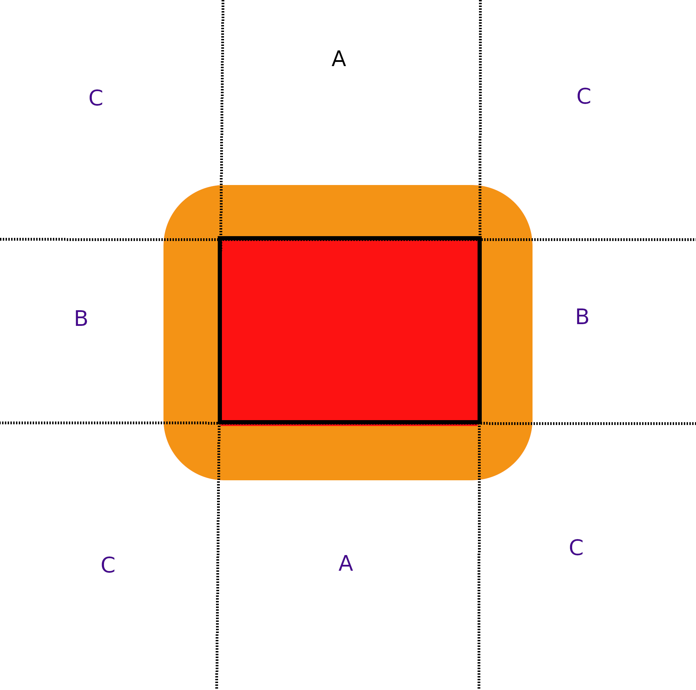

# Intersecção de um círculo com um retângulo

[Exemplo de problema](https://www.urionlinejudge.com.br/judge/pt/problems/view/2632)

Dado um retângulo com a coordenada do vértice inferior esquerdo e as suas dimensões conhecidas, e um círculo com a coordenada do centro e raio conhecido o problema é: há alguma interseção entre as formas?

Visualização do retângulo:



Para o círculo se interseccionar com o retângulo, seu centro deve estar dentro da área do retângulo(vermelha) ou a uma distância máxima de até seu raio do retângulo(parte laranja). Assim, as seguintes condições devem ser checadas:

1) O centro do círculo está dentro da área do retângulo?

Se sim então eles se intersecionam.

2) O centro do círculo está ná area A?

Se sim então: se a distância entre o centro do círculo e o segmento de reta mais próximo do círculo é menor ou igual ao raio do círculo? Se sim então eles se intersecionam .(Nesse exemplo foi calculada as duas distâncias e usada a menor).

2) O centro do círculo está ná area B?

Se sim então: se a distância entre o centro do círculo e o segmento de reta mais próximo do círculo é menor ou igual ao raio do círculo? Se sim então eles se intersecionam .(Nesse exemplo foi calculada as duas distâncias e usada a menor).


2) O centro do círculo está ná area C?

Se sim então: se a distância do centro do círculo à algum dos 4 vértices do retângulo for menor ou igual ao raio do círculo eles se intersecionam.

Se nenhuma das condições acima foi satisfeita as formas não se intersecionam.

Exemplo de algoritmo em c++:

```cpp
/* Distância entre dois pontos */
double distPointPoint(pair<int, int> p1, pair<int, int> p2) {
    return (sqrt(pow((p2.second - p1.second), 2.0) +
                 pow((p2.first - p1.first), 2.0)));
}
/* Distância entre um ponto e uma linha definida por dois pontos */
double distPointLine(pair<int, int> Lp1, pair<int, int> Lp2,
                     pair<int, int> p0) {
    // return abs(((Lp2.second - Lp1.second) * p0.first) -
    //           ((Lp2.first - Lp1.first) * p0.second) +
    //           (Lp2.first * Lp1.second) - (Lp2.second * Lp1.first)) /
    //       distPointPoint(Lp1, Lp2);

    return abs(((Lp2.first - Lp1.first) * (Lp1.second - p0.second)) -
               (Lp1.first - p0.first) * (Lp2.second - Lp1.second)) /
           distPointPoint(Lp1, Lp2);
}

bool intersect(pair<int, int> XYretan, int w, int h, pair<int, int> XYcirc,
               int raio) {
    /* O centro do círculo está dentro do retângulo */
    if ((XYcirc.first >= XYretan.first) &&
        (XYcirc.first <= (XYretan.first + w)) &&

        (XYcirc.second >= (XYretan.second)) &&
        (XYcirc.second <= (XYretan.second + h)))
        return true;

    const vector<pair<int, int>> vertices = {
        {XYretan.first, XYretan.second},
        {XYretan.first + w, XYretan.second},
        {XYretan.first, XYretan.second + h},
        {XYretan.first + w, XYretan.second + h},
    };

    /* A distância entre o centro do círculo e um dos lados é menor que o raio
     */
    if ((XYcirc.first >= XYretan.first) &&
        (XYcirc.first <= (XYretan.first + w)) &&
        min(distPointLine(vertices[0], vertices[1], XYcirc),
            distPointLine(vertices[2], vertices[3], XYcirc)) <= raio)
        return true;

    else if ((XYcirc.second >= XYretan.second) &&
             (XYcirc.second <= (XYretan.second + h)) &&
             min(distPointLine(vertices[0], vertices[2], XYcirc),
                 distPointLine(vertices[1], vertices[3], XYcirc)) <= raio)
        return true;

    else {
        /* A distância entre o centro do círculo e um dos vértices
         * é menor que o raio do círculo */
        for (auto i : vertices) {
            if (distPointPoint(i, XYcirc) <= raio) return true;
        }
    }

    /* Não há intersecção */
    return false;
}
```
